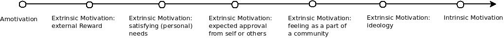

% Out of Altruism or Because it Reads Well on the CV?
% The Motivations for Participation in the Freifunk Community Compared to FLOSS
% Lyudmila Vaseva (vaseva@mi.fu-berlin.de)

---

# March 2013

!friends
!freifunk

---

# Exkurs: Community Networks

* free, decentralised communication infrastructure set up and managed by its users
* free firmware
* free access to the network for everyone with a wifi capable device
* information is passed along without tampering or prioritising

---

# August 2016

---

# Why?

---

# Threats to Validity

1. "Working for Free? Motivations for Participating in Open-Source Projects" Alexander Hars und Shaosong Ou (2002)
2. "Why Hackers Do What They Do: Understanding Motivation in Free/Open Source Software Projects" Karim Lakhani und Robert Wolf (2005)

note: don't want transitions here!

---

# Organisation of the findings

---

# Why have you started to participate in Freifunk? What's cool about the project?
  (Motivations overview / Otöne) --> vlt auch zu den jeweiligen "Kapitel" runterziehen

---

* "I liked the idea of connecting people in a decentralised, non-commercial manner"
* "It's a charming idea: to radio with each other, to do things with the network, to connect people in the hood, to do community based work (not only Internet related)"
* "it was the refugee context: I found it important to provide a communication infrastructure to people who don't have one."
* "I've founded it^^"
* "There was no (usable) Internet in Friedrichshein till 2003"
* "Intersection community -- technic is intriguing"
* "the legal regulations changed, so it was at once possible to freely deploy wifi networks"
* "from today's perspective: how big it has become"
* "I've learnt a lot about how communities work and don't, how much structure is helpful/not, what voluntary work means, what tasks get ignored and why, what should be decided at all costs and who decides, ..."

---

## Extrinsic Motivation: expectation of a future reward

* no monetary compensation
* not seen as networking/visibility platform
* polish technical skills, learn about (wifi mesh) networks (6 of 16 people)
* "learnt a lot about network technic (there's scarcely another free time project where you can learn so much about it)"

~ (TODO: transition!) $\rightarrow$ byproduct, not a primary source of motivation

---

## Extrinsic Motivation: satisfying (personal) needs

* Before 2008: "There was no (usable) Internet in Friedrichshein in 2003"
* After: "share the own internet connection with people who need it! (today, primarily refugees)"

---

## Extrinsic Motivation: expected approval from self or others

* "it's cool to have the feeling that people need you"
* "you can see that people use it (refugees; students; positive feedback)"

---

## Extrinsic Motivation: feeling as a part of a community

* "building a project together with others"
* "I've grown to love the community"
* "collaborating with and getting to know people of different ages and backgrounds, which would have hardly happened in a different setting"
* "one gets to know interesting and different people, comes out of one's comfort zone and social bubble"
* the intersection of community and technology: the most interesting part of the Freifunk project
* how it works (or does not work) to organise a community, what volunteer work means, what people do with pleasure and which tasks get ignored and forgotten and why, who has the power to decide things and whether it is necessary to debate and formulate decisions for everything, and most importantly, how to involve newcomers so that the project does not fall apart and how to prevent and deconstruct hierarchies in knowledge

---

## Extrinsic Motivation: ideology

* "there is a right to free communication and information"
* "free, decentralised communication infrastructure built and managed by the people who use it and not by the state or business players"
* "independent network, cannot be switched off by a single person"
* "decentralised infrastructure is good, but it also makes things difficult"

~ (TODO: transition!) $\rightarrow$ political aspect plays a very central role

---

## Intrinsic Motivation

* technically interesting/challenging (14 out of 16 people)
* "there's stuff you can physically touch (more tangible compared to coding), it makes you happy :)"
* "you can climb on church towers and look at the city from above, which is pretty cool :)"
* "it's technically challenging despite the fact that I've abandoned the idea that it could be an alternative to the last mile of the German Telekom"
* "challenge: to get maximal results with minimus resources"

---

# What's not so cool?

---

### Sharing knowledge gets neglected

* "the idea of sharing knowledge is not as focused as it should be"
* "there are knowledge hierarchies, at the end people are not really glad to work without hierarchies"
* "it's tough to have so much egos screaming for attention piled together"

---

### The communication/discussion culture

* "working in team is often difficult"
* "when people think, they've found THE way and try to push it onto everybody else and seize control"
* "if there are battles between single persons, it sometimes endagers the whole project"
* "meetings with a lot of talking and little actions are annoying"

---

### Gender

* "community consists primarily of men, it's difficult to open up"

---

### Difficult to communicate the idea

* "it's difficult to convey the topic of informational self-determination to people outside the community. It's only starting to get more present in the current refugee context"
* "there are users with a service mentality who only complain when stuff doesn't work but do not actively try to do something about it"

---

### (technical) Limitations

* "unfortunately, the political idea is not really scalling (technically)"
* "the whole project depends too much on the effort of single people; only few really do understand how it works and are able to manage it"
* "it only gets technically interesting if the network grows, however, it then does attract the service mentality people and drives away the developers"

---

# Conclusions

* studying motivations' development over longer time units
* asking more people and more elaborate questions would be cool
* comparison between different projects would be even cooler

---

# Thank you!

---

# Licence

These slides are under the [by-sa Creative Common Lizenz](https://creativecommons.org/licenses/by-sa/4.0/).

