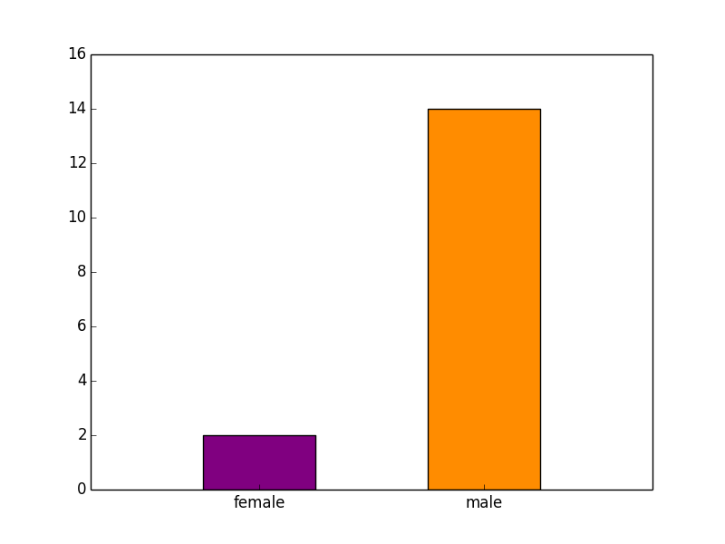
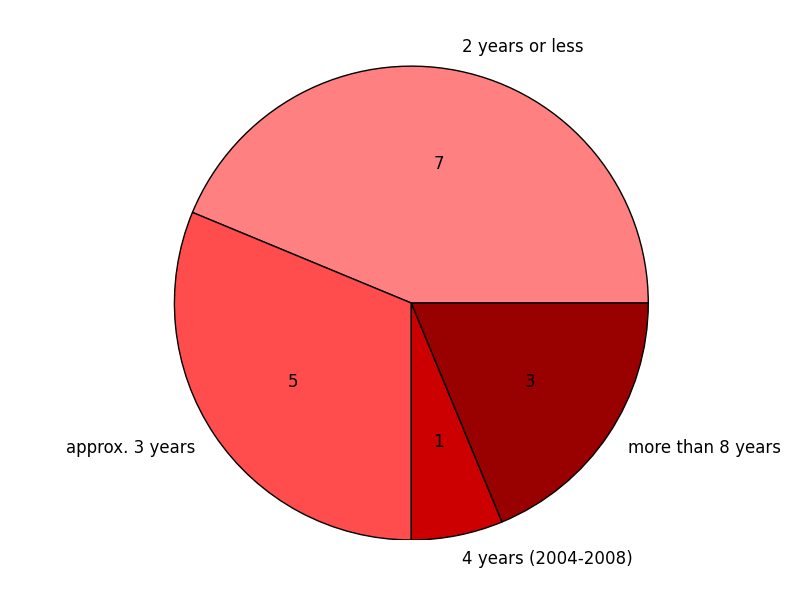

% Why do freifunkers do what they do?
% lusy (vaseva@mi.fu-berlin.de)

---

(perceived) gender:

---

How long have people been participating?

---

community

* Berlin: 9
* Rheinland: 3
* Hannover: 1
* Bremen: 1
* Bielefeld: 1
* Hamburg: 1

---

# Some more curious remarks

---

# Why have you started to participate in Freifunk?

---

* "I liked the idea of connecting people in a decentralised, non-commercial manner"
* "It's a charming idea: to radio with each other, to do things with the network, to connect people in the hood, to do community based work (not only Internet related)"
* "it was the refugee context: I found it important to provide a communication infrastructure to people who don't have one."
* "I've founded it^^"
* "There was no (usable) Internet in Friedrichshein till 2003"
* "Intersection community -- technic is intriguing"
* "the legal regulations changed, so it was at once possible to freely deploy wifi networks"

---

# What's cool about the project? What's your primary motivation?

---

### Project / community work

* "from today's perspective: how big it has become"
* "I've learnt a lot about how communities work and don't, how much structure is helpful/not, what voluntary work means, what tasks get ignored and why, what should be decided at all costs and who decides, ..."

---

### free infrastructure

* "there is a right to free communication and information"
* "free, decentralised communication infrastructure built and managed by the people who use it and not by the state or business players"
* "independent network, cannot be switched off by a single person"
* "decentralised infrastructure is good, but it also makes things difficult"

---

### Provide access to Internet to people who don't have it

* "There was no (usable) Internet in Friedrichshein in 2003"
* "share the own internet connection with people who need it! (today, primarily refugees)"

---

### Educational Mandate

* "a lot of people have learnt a lot about it infrastructure in this context"
* "education: what's computer network, how does it work, how secure is it?"

---

### Social Networking / Community Feeling

* "the community" / "the people"
* "I've grown to love the community (not only in H, but everywhere)"
* "social interconnectedness: (international) contacts made"
* "one gets to know interesting and different people, comes out of one's comfort zone and social bubble"

---

### Technically interesting/challenging

* "there's stuff you can physically touch (more tangible compared to coding), it makes you happy :)"
* "you can climb on church towers and look at the city from above, which is pretty cool :)"
* "it's technically challenging despite the fact that I've abandoned the idea that it could be an alternative to the last mile of the German Telekom"
* "challenge: to get maximal results with minimus resources"

---

### Broading the own technical know-how

* "learnt a lot about network technic (there's scarcely another free time project where you can learn so much about it)"

---

### The feeling that my work is needed and valued

* "it's cool to have the feeling that people need you"
* "you can see that people use it (refugees; students; positive feedback)"

---

# What's not so cool?

---

### Sharing knowledge gets neglected

* "the idea of sharing knowledge is not as focused as it should be"
* "there are knowledge hierarchies, at the end people are not really glad to work without hierarchies"
* "it's tough to have so much egos screaming for attention piled together"

---

### The communication/discussion culture

* "working in team is often difficult"
* "when people think, they've found THE way and try to push it onto everybody else and seize control"
* "if there are battles between single persons, it sometimes endagers the whole project"
* "meetings with a lot of talking and little actions are annoying"

---

### Gender

* "community consists primarily of men, it's difficult to open up"

---

### Difficult to communicate the idea

* "it's difficult to convey the topic of informational self-determination to people outside the community. It's only starting to get more present in the current refugee context"
* "there are users with a service mentality who only complain when stuff doesn't work but do not actively try to do something about it"

---

### (technical) Limitations

* "unfortunately, the political idea is not really scalling (technically)"
* "the whole project depends too much on the effort of single people; only few really do understand how it works and are able to manage it"
* "it only gets technically interesting if the network grows, however, it then does attract the service mentality people and drives away the developers"

---

# Specific questions

---

### Freifunk is technically challenging and it\'s fun to work on the project

* 10 yes
* 1  it's not thaat challenging, but it's fun
* 1  yeah... it's not the primary motivation; it's challenging but not always fun
* 1  the technical part is rather boring

---

### I want to learn the technical aspects of how wifi/mesh networks/etc. work

*  6 yes
*  1 I had to, in order to implement the concept
*  1 that wasn't my intention, but it happened at the end: "x doesn't work, I want to fix it"
*  2 yeah, I wanted to learn individual aspects, but it wasn't my primary focus
*  3 basically, I already knew how everything worked

---

### I wanted to learn more about the legal framework within which the project operates

*  9 well, it's inevitable if you want to make the project work (not very enjoyable but important)
*  2 noe, not really
*  1 noe, I don't want to fit into predefined hierarchies
*  1 it wasn't a motivation to join Freifunk, but it's interesting to deal with it
*  1 it isn't uninteresting, but it's better if it's dealt with by people, who can do it better
*  1 yeah (works on the lobby field, is politically motivated; not initial motivation, but it later became one)

---

### I want to have a free communication infrastructure in the hands of the community, because I think it's not a good idea that this is controlled by a couple of business players

*  8 yes (3 of them affirmed pretty vigorously)
*  2 yes (communication infrastructure in the hands of civil society; the industry has its own, the state too)
*  3 yes (but I don't believe anymore that Freifunk can provide this completely)
*  1 yes (note: it's difficult, if a lot of the decentralised infrastructure belongs to a single person)

---

### I started to participate because commercial providers didn't have any interest of providing me with an efficient Internet connection

*  2  yes
*  10 no
*  1  no, but I'll be shortly working on a project for a refugee shelter, where this is the case
*  1  no, via Freifunk I share my Internet connection with others

---

### I care for net neutrality

*  6 yes
*  1 yes (but sensibility for this issue is not necessarily present in the Freifunk context)
*  4 yes (but doesn't regard Freifunk as a struggle for net neutrality)
*  1 yes (but to demand it at any price what is difficult and not particularly clever)
*  1 yes (the Pico Peering Agreement is really important!)
*  1 yes (one can at least try\ldots)

---

### I'm providing professional services related to Freifunk: I receive money for hardware installations, maintenance, etc

*  9 no
*  1 yeah, one can say there's something professional\ldots I invest a lot of time and energy in the project and have on occasions received money for my work in this context
*  1 I work professionally with wifi and mesh (not Freifunk); it was more a consequence of Freifunk than a motivation for collaboration
*  1 I work professionally on wifi installations but try to keep both things separate

---

### I want to work in this field later, so my participation in Freifunk is an excellent opportunity to polish my technical skills, make new contacts and become visible for potential employers

*  2 no (it was more the other way round: that was a field where I could apply the knowledge I already had)
*  6 no
*  1 no (but if I wanted to do wifi professionally, the Freifunk community would be a good networking platform)
*  3 no (it surely happens, but it isn't a motivation for me to engage in the project)
*  2 no (it's something I'd write on my CV, but it wasn't a reason for me to join)

---

# Conclusions

* asking more people and more elaborate questions would be cool
* comparison between different projects would be even cooler

---

# Licence

These slides are under the [by-sa Creative Common Lizenz](https://creativecommons.org/licenses/by-sa/4.0/).

